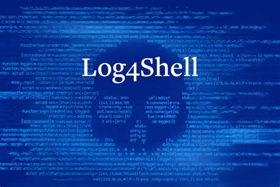

In November 2021, a critical vulnerability sent shockwaves throughout the cybersecurity community. Known as **Log4Shell** (CVE-2021-44228), this flaw in the Apache Log4j logging library demonstrated how a seemingly innocuous component could be exploited to take control of entire systems. In this article, we’ll break down what Log4Shell is, how it works, who discovered it, and why it matters—not only for professionals in the field but also for students eager to understand the intricacies of modern cybersecurity challenges.

## What is Log4j?

Apache Log4j is a popular open-source logging framework used by countless Java applications around the world. It enables developers to record various types of runtime information—from error messages to user input—thus playing a crucial role in application monitoring and debugging.

## Understanding the Log4Shell Vulnerability

### What Is Log4Shell?

Log4Shell is a security vulnerability within the Log4j library that allows attackers to execute arbitrary code on a target system. This remote code execution (RCE) capability means that if exploited, an attacker can potentially take over a system without needing to authenticate or have prior access.

### How Does It Work?

The vulnerability hinges on how Log4j processes log messages. Here’s a simplified breakdown of the mechanics:

- **Input Processing:** When Log4j logs a message, it processes the content for special patterns.
- **JNDI Lookup:** The vulnerability exploits the Java Naming and Directory Interface (JNDI). By injecting a maliciously crafted string into a log message, an attacker can trick Log4j into initiating a JNDI lookup.
- **Remote Code Execution:** This lookup reaches out to an attacker-controlled server that provides a malicious payload. When the payload is loaded, it executes code on the target system—granting the attacker significant control.

This process transforms a seemingly harmless log entry into a potential backdoor for malicious actors.

## Discovery and Disclosure

The Log4Shell vulnerability was first discovered by Chen Zhaojun from Alibaba Cloud’s security team on November 24, 2021. The issue was publicly disclosed on December 9, 2021, after a proof-of-concept exploit was shared online. The rapid public disclosure highlighted the severity of the vulnerability and mobilized security teams worldwide to mitigate its impact.

## The Exploitation Process

### Crafting the Exploit

Exploiting Log4Shell is alarmingly straightforward:
- **Malicious Input:** An attacker sends a specially crafted string to an application that uses Log4j.
- **Triggering JNDI:** The string initiates a JNDI lookup to a server controlled by the attacker.
- **Payload Execution:** The attacker’s server delivers a malicious payload, which gets executed on the vulnerable system.

### Impact on Affected Systems

Due to the widespread use of Log4j in various applications—from enterprise software to cloud services—the vulnerability had the potential to affect a vast array of systems worldwide. The exploit could lead to:
- **Data Theft:** Unauthorized access to sensitive information.
- **Ransomware Deployment:** Inserting ransomware to hold systems hostage.
- **Botnet Creation:** Enrolling compromised systems into a larger network of controlled devices.

## Response and Mitigation

### Apache’s Quick Action

In response to the disclosure, the Apache Software Foundation quickly released a series of patches, starting with version 2.15.0. Subsequent updates were issued to further harden the library and address any emerging concerns.

### The Ongoing Challenge

Despite the patches, the widespread integration of Log4j into countless applications means that completely mitigating the risk is an ongoing challenge:
- **Inventory Management:** Organizations must identify every instance of Log4j across their systems.
- **Timely Updates:** Ensuring that all affected systems are updated promptly can be logistically complex.
- **Continuous Monitoring:** Even after patching, vigilance is required to detect any unusual activity that might indicate exploitation.

## Conclusion

The Log4Shell vulnerability is more than just a technical flaw—it’s a stark reminder of the dynamic nature of cybersecurity threats. As our reliance on interconnected systems grows, so does the importance of understanding and mitigating such vulnerabilities. Whether you are a seasoned professional or a cybersecurity student, the lessons from Log4Shell emphasize the need for vigilance, proactive security measures, and continuous learning in an ever-evolving digital landscape.

Stay informed, stay secure, and remember: sometimes the smallest flaw can open the door to the biggest threats.
